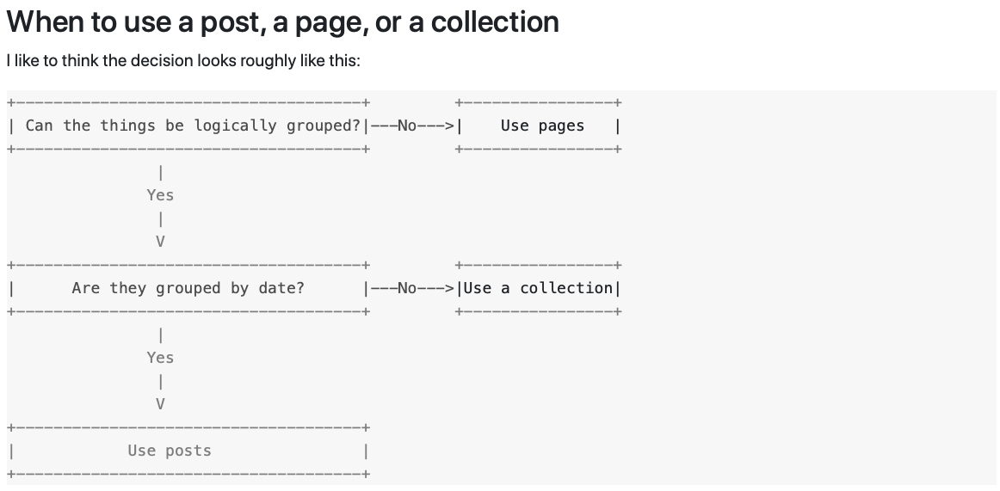

## Requisite
* Install Jekyll following [instructions](https://jekyllrb.com/docs/installation/)
* Clone [beatiful jekyll repo](https://github.com/daattali/beautiful-jekyll)
* Run jekyll on local
1. build web-site: ``` bundle exec jekyll build ``` -> generate folder ```_site```
2. run jekyll server: ``` bundle exec jekyll serve ```


**Note**
> when you add/edit/modify any file from anywhere in project, the website will be updated automatically
> restart jekyll whenever you modify file ```_config.yml```

## Table of Contents
* [Beautiful Jekyll Architecture](#beautiful-jekyll-architecture)
* [Jekyll Contents](#jekyll-contents)
* [Jekyll Collections vs Posts](#jekyll-collections-vs-posts)


##  Beautiful Jekyll Architecture


## Jekyll Contents



## Jekyll Collections vs Posts
* Collections
  * a **cleaner directory/sub-directories structure** without <span style="color:red">_posts</span> folder in each nested level
  * **cleaner filenames** without mandatory dates
  * In a heirarchical sub-directory structure, *categories* can be simulated processing the <span style="color:red">path</span> property of each file
  * Collection filenames emphasize in <span style="color:red">title</span>, not the <span style="color:red">date</span>
* Posts
  * Posts filenames emphasize in <span style="color:red">dates</span>, not the <span style="color:red">titles</span>
  * Each post create its own subdirectory *index*
  * Automatically grouped by *tag index*

|#|Collection|Post|
|-|----------|----|
| directories | /_topics/deep-learning/|/topics/deep-learning/_posts/
|file name| item.md | 2020-08-11-item.md|
| page.categories | |["topics", "deep-learning"]|
| page.date | from creation date: 2020-08-11 00:00:00 | from filename: 2020-08-11|
| Document access| site.topics, site.collections     | site.categories.deep-learning, site.collections, site.categories.topics or site.posts |
| file url | http://example.github.io/topics/deep-learning | /topics.html with permalink: "/topics/deep-learning" or /topics/deep-learning/index.md |


## References
 * [why and how to use collections in jekyll](https://dev.to/devdiaries/why-and-how-to-use-collections-in-jekyll-4b89)
 * [jekyll collections](https://ben.balter.com/2015/02/20/jekyll-collections/)
 * [it-rocks](https://simpleit.rocks/ruby/jekyll/collections/jekyll-collections-versus-posts/)


