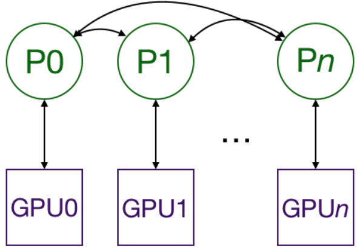

Distributed data parallel training in Pytorch

## Motivation
The easiest way to speed up neural network training is to use a GPU, which provide large speedups over CPUs. As the model or dataset gets bigger, one GPU quickly becomes insufficient. And thus, to perform multi-GPU training, we must have a way to split the model and data between different GPUs and to coordinate the training.

## Distributed Data Parallel
Pytorch has two ways to split models and data across multiple GPUs:
 * ```nn.DataParallel```: uses one process to compute the model weights and then distribute them to each GPU during each batch, networking quickly becomes a bottle-neck and GPU utilization is often very low.
 * ```nn.DistributedDataParallel```: requires that all the GPUs be on the same node and doesn't work with ```Apex``` for ```mixed-precision``` training.

Multiprocessing with ```DistributedDataParallel``` duplicates the model across multiple GPUs, each of which is controlled by one process. (A process is an instance of python running on the computer; by having mutiple processes running in parallel, we can take advantage of processors with multiple CPU cores. If you want, you can have each process control multiple GPUs, but that should be obviously slower than having one GPU per process.)



During training, each process loads its own minibatches from disk and passes them to its GPU. Each GPU does its own forward pass, and then the gradients are all-reduced across the GPUs. Gradient for each layer do not depend on previous layers, so the gradient all-reduce is calculated concurrently with the backwards pass to further alleviate the networking bottleneck. At the end of the backwards pass, every node has the averaged gradients, ensuring that the model weights stay synchronized.

## The Existing Documentation is Insufficient
In general, the Pytorch documentations is thorough and clear, especially in version 1.0.x. 
Pytorch provides a [tutorial](https://pytorch.org/tutorials/beginner/aws_distributed_training_tutorial.html) on distributed training using AWS, which does a pretty good job of showing you how to set things up on the AWS side. However, the rest of it is a bit messy, as it spends a lot of time showing how to calculate metrics for some reason before going back to showing how to wrap your model and launch the processes. It also doesn't describe what ```nn.DistributedDataParallel``` does, which makes the relevant code blocks difficult to follow.

The [tutorial](https://pytorch.org/tutorials/intermediate/dist_tuto.html) on writing distributed applications in Pytorch has much more detail than necessary for a first pass and is not accessible to sombody without a strong background on multiprocessing in Python.

## References
 * Pytorch [tutorial](https://pytorch.org/tutorials/)
 * Distributed Data Parallel [tutorial](https://yangkky.github.io/2019/07/08/distributed-pytorch-tutorial.html)

