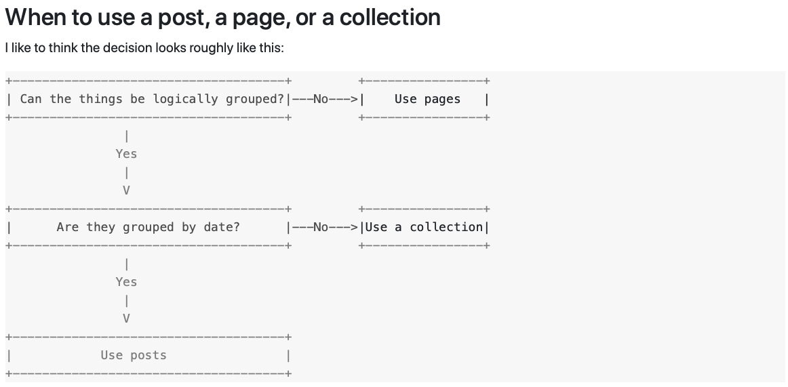

## Date
 * 2020-08-07
   - Working with config file. [tutorial](https://github.com/sverrirs/jekyll-paginate-v2/blob/master/examples/01-typicalblog/_config.yml)

 * 2020-08-08
   - Working with Jekyll
     - to build blog in order to run on local
     ```
     bundle exec jekyll build
     bundle exec jekyll serve
     ```
     - to check service jekyl serve
     ```
     ps aux | grep jekyll
     kill -i pid # with pid is id of jekyll serve service
     ```
   
   - Posts, Pages and Collections in Jekyll

   
   
## References
 * [why and how to use collections in jekyll](https://dev.to/devdiaries/why-and-how-to-use-collections-in-jekyll-4b89)
 * [jekyll collections](https://ben.balter.com/2015/02/20/jekyll-collections/)
 * [it-rocks](https://simpleit.rocks/ruby/jekyll/collections/jekyll-collections-versus-posts/)