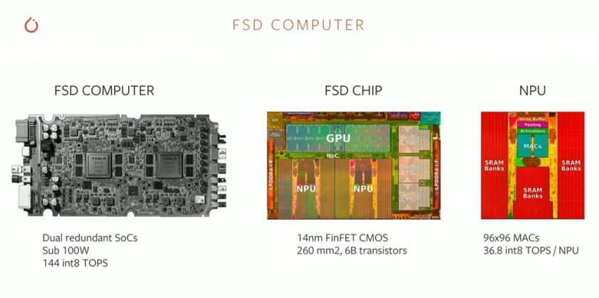
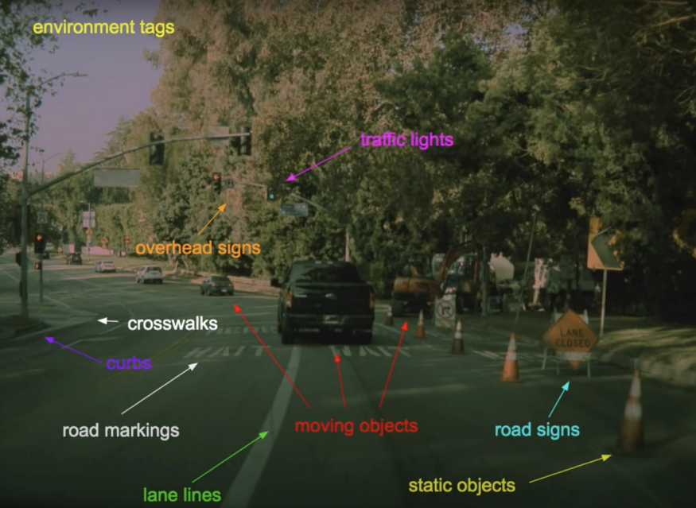
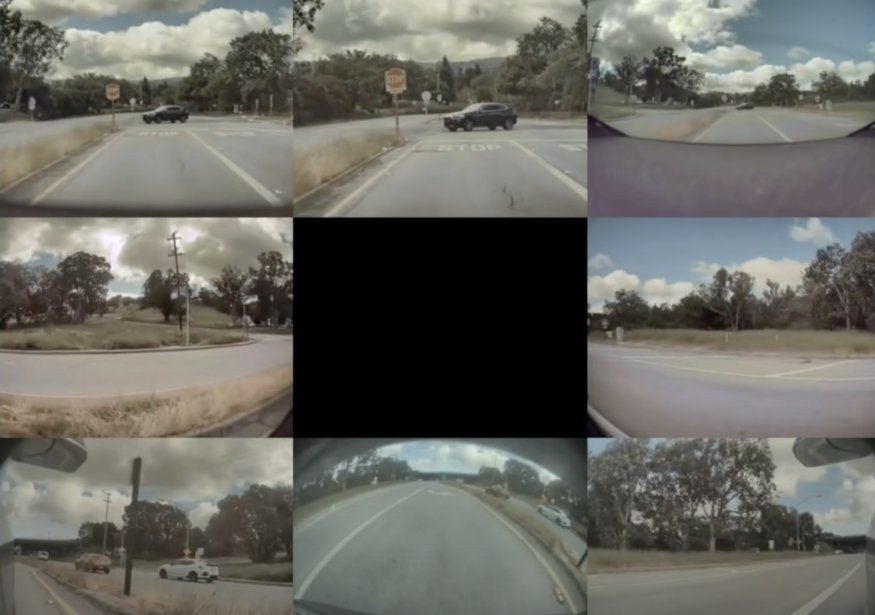

Many thanks to Mr.Jeremy Cohen's [blog](https://heartbeat.fritz.ai/computer-vision-at-tesla-cd5e88074376) 

When we look at the computer visio world, we can see a real gap between reality and online courses.

For instances, you might learn in an online course how to run a YOLO network, but a real-world use case might asks for 7 YOLO networks in distributed GPUs and a [HydraNet](https://www.autopilotreview.com/teslas-andrej-karpathy-details-autopilot-inner-workings/) architecture.

According to Tesla:**About 50 tasks must be done on-device, simultatneously, in a computer that doesn't take too much space**

*Tesla FSD Computer*

## Contents
* [The tasks](#the-tasks)
* [The sensors](#the-sensors)
* [The neural networks](#the-neural-networks)
* [Full stack review](#full-stack-review)

### The tasks

The main function of any auto-pilot system, including the ones at Tesla, is to **stay in the correct lane**, then to **change lanes to follow the right trajectory**

### The sensors

Tesla only using 8 cameras on its vehicles with additional RADARs sensor. By using images from those 8 cameras, they can cover all areas surrouding the vehicle so that there's no blind spot

## The neural networks
The Tesla's neural networks has a lot of work to determine distance between the vehicles, lane detection, crosswalks detection, pedestrians detection, etc. And, in fact, they **must run at least 50 neural networks simultaneously** to make it work.
 
>
> Tesla uses a specific architecture call [HydraNets](https://rmullapudi.bitbucket.io/data/hydranet_cvpr_final.pdf?utm_source=Jeremy+Cohen&utm_campaign=15c163eaa1-EMAIL_CAMPAIGN_2020_07_10_08_05&utm_medium=email&utm_term=0_9a0160b0e8-15c163eaa1-), where the backbone is shared.
>

Similar to transfer learning, HydraNets have backbones trained on all objects

## Full stack review
* **Data** - Tesla collects data from the vehicles and annotates it
* **GPU Cluster** - Tesla uses multiple GPUs to train their neural networks and run them
* **DOJO** - Tesla uses something they call <i>DOJO</i> to train only a part of the whole architecture for a specific task. It's very similar to whaty they do in inferences
* **Pytorch Distributed Training** - Tesla uses Pytorch for training 
* **Evaluation** - Tesla evaluates network training using loss functions
* **Cloud Inference** - Cloud processing allows Tesla to improve its fleet of vehicles at the same time
* **Inference at FSD** - Tesla built its own edge computer that has its own Neural Processing Unit (NPU) and GPUs for inference
* **Shadow Mode** - Tesla collects results and data from the vehicles and compares them with the predictions to help improve annotations

## References
 * [Tesla Andrej Karpathy details autopilot inner workings](https://www.autopilotreview.com/teslas-andrej-karpathy-details-autopilot-inner-workings/)
