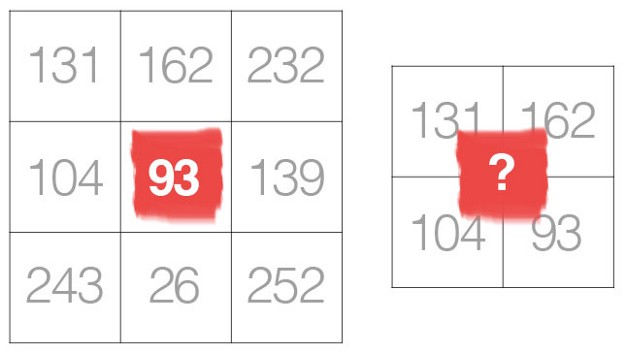

Convolutional Neural Networks (CNNs) extract useful features (**without manual hand-tuning**) from data-points like images in order to solve some give tasks like image classification or object detection.

 * In a convolution, a convolution filter slides over all the pixels of the image producing their dot product.
 * Most of the useful features in an image are usually local and it makes sense to take few local pixels at a time to apply convolutions.
 * In addition, an added benefit of using a small kernel instead of a fully connected network is to benefit from weight sharing and reduction in computational costs. 

##  Size of filters

**Conlusion:** the smaller kernel sizes are and should be a popular choice over larger sizes.

## Odd-sized filters vs Even-sized filter

For and odd-size filter, all the previous layer pixels would be symmetrically around the output pixel. Without this symmetry, we will have to account for distortions acress the layers which ahppens when using an even-sized kernel.
Therefore, even-sized kernel filters are mostly skipped to promote implementation simplicity.
