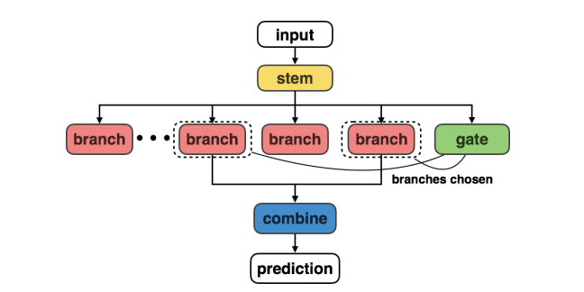
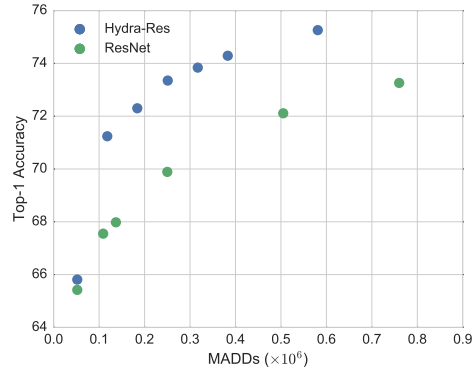
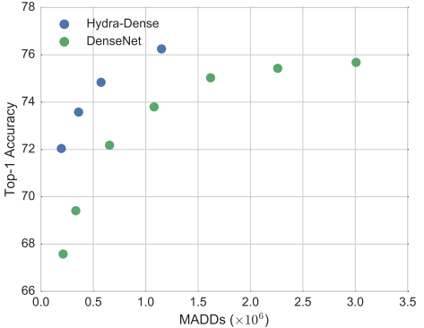

> *The HydraNet architecture: contains multiple <i>branches</i> specialized for different inputs and a <i>gate</i> chooses which branches to run when performing inference on an input, and a combiner that aggregates branch outputs to make final predictions.*

## Contents
* [Abstract](#abstract)
* [HydraNet Architecture](#hydranet-architecture)
* [Experiments](#experiments)

## Abstract
HydraNets are wide networks containing distinct components specialized to compute features for visually similar classes, but retain efficiency by dynamically selecting only a small number of components to evaluate for any one input images

## HydraNet Architecture
The HydraNet has four major components
* **Branches** - which are specialized for computing features on visually similar classes. Computing features relevant to a subset of the network inputs as as a *subtask* of the larger classification task.
* **A stem** - that computes features used by all branches and in deciding which subtasks to perform for an input.
* **The gating** - mechanism which decides what branches to execute at inference by using features from the stem.
* **A combiner** - which aggregates features from multiple branches to make final perdictions.

## Experiments
| (a) ResNet architecture | (b) DenseNet architecture |
|-------------------------|---------------------------|
|  |  |

*Inference cost vs accuracy of HydraNet for CIFAR-100 classification. HydraNet architectures have the same accuracy as the baseline ResNet and DenseNet architecture at lower dynamic cost*

| Model        | Params (x10e6) | Inferences MADDs (x10e6) | Accuracy (Top-1) |
|--------------|----------------|--------------------------|------------------|
| Hydra-Res-d1 | 1.28           | 52                       |            65.81 |
| Hydra-Res-d2 | 1.28           | 52                       |            65.81 |
| Hydra-Res-d3 | 1.28           | 52                       |            65.81 |
| Hydra-Res-d4 | 1.28           | 52                       |            65.81 |
| Hydra-Res-d5 | 1.28           | 52                       |            65.81 |
| Hydra-Res-d6 | 1.28           | 52                       |            65.81 |
| Hydra-Res-d7 | 1.28           | 52                       |            65.81 |
| Hydra-Res-d8 | 1.28           | 52                       |            65.81 |
| Hydra-Res-d9 | 1.28           | 52                       |            65.81 |
| ResNet-14    | 1.28           | 52                       |            65.81 |
| ResNet-20    | 1.28           | 52                       |            65.81 |
| ResNet-26    | 1.28           | 52                       |            65.81 |
| ResNet-32    | 1.28           | 52                       |            65.81 |
| ResNet-14    | 1.28           | 52                       |            65.81 |

*Computation cost and CIFAR Top-1 accuracy of serval variants of HydraNet architectures and baseline architectures.*

## References
* Paper: [HydraNet](https://openaccess.thecvf.com/content_cvpr_2018/papers_backup/Mullapudi_HydraNets_Specialized_Dynamic_CVPR_2018_paper.pdf)
* Source Code: [raghav1818/HydraNet](https://github.com/raghav1810/HydraNet)

