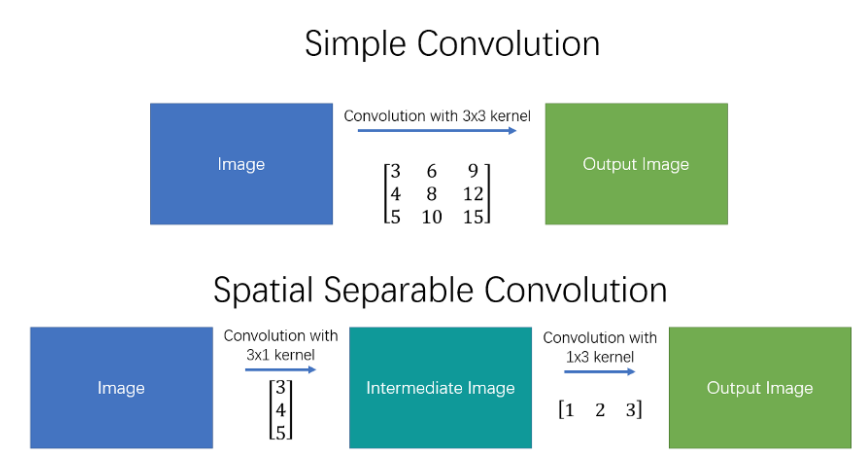
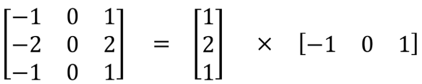
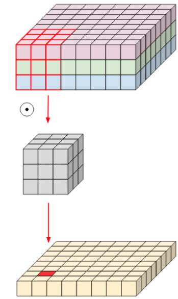
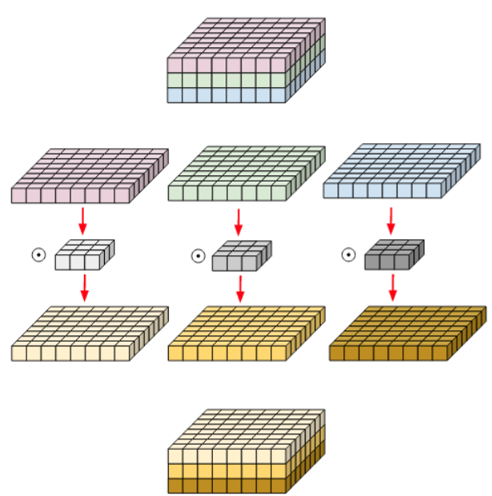
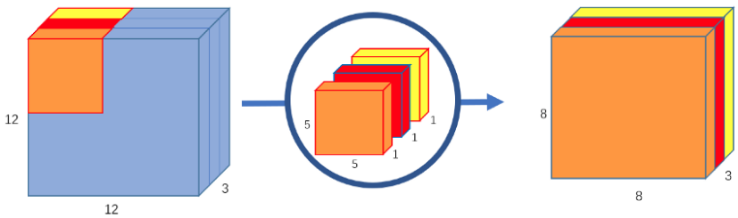

There are two main types of seperable convoltuions: 
 * [Spatial separable convolutions](#spatial-separable-convolutions)
 * [Depthwise separable convolutions](#depthwise-separable-convolutions)

## Spatial Separable Convoltuions
The spatial separable convoltuion deals primarily with the **spatial dimenstions** of an image and kernel: the height and width.
 
A spatial separable convolution simply divides a kernel into two, smaller kernels. For examples, 3x3 -> 3x1 and 1x3. And thus, instead of using 3x3=9 multiplications, we only use 3x1+1x3=6 multiplications => computational complexity goes down, and the network is able to run faster.

    
     
        <em>Figure 1. Separable Convolutions</em>

One of the most famous convolutions that can be separated spatially is the Sobel kernel, used for edges detection

<em>Figure 2. Separating the Sobel kernel</em>

**However,** the main issue with the spatial separable convolution is that not all kernels can be "separated" into two, smaller kernels. This becomes particularly bothersome during training, since of all the possible kernels the network could have adopted, it can only end up using one of the tiny portion tha can be separated two smaller kernels.

## Depthwise Separable Convoltuions
Unlike spatial separable convoltuions, depthwise separable convolutions work with kernels that cannot be "factored" into two smaller kernels. 
The depthwise separable convolution deals not only with the spatial dimensions, but also with the depth dimension (the number of channels).  
Similar to the spatial separable convolution, a depthwise separable convolution splits a kernel into 2 separate kernels that do two convolutions:
 * [The Depthwise Convolution](#the-depthwise-covolution)
 * [The Pointwise Convolution](#the-pointwise-convolution)

### Normal Convolution

<em>Figure 3. A Normal Convolution</em>

### The Depthwise Convolution
In depthwise convolution, we use each filter channel only at one input channel. In the example, we have 3 channel filter and 3 channel image, then we break the filter and image into three different channels and convolve the corresponding image with corresponding channel and then tack them back.

 

<em>Figure 4. A Depthwise Convolution</em>

Each 5x5x1 kernel iterates 1 channel of the image (note: **1 channel**, not all channels), getting the scalar products of every 25 pixel group, giving out a 8x8x1 image. Stacking these images together creates a 8x8x3 image.

### The Pointwise Convolution
The pointwise convolution uses a 1x1 kernel, or a kernel that iterates through every single point. This kernel has a depth of however many channels the input image has. Therefore, we iterate a 1x1x3 kernel through 8x8x3 image, to get a 8x8x1 image.

<em>Figure 5. </em>

### Alright, but what's the point of creating a depthwise separable convolution?
Let's calculate the number of multiplications the computer has to do in the original convolution.
 
There are 256 5x5x3 kernels that move 8x8 times.  
> 256x3x5x5x8x8 = 1,228,800 multiplications

In the depthwise convolution, we have 3 5x5x1 kernels that move 8x8 times.
> 3x5x5x8x8 = 4,800 multiplications

In the pointwise convolution, we have 256 1x1x3 kernels that move 8x8 times.
> 256x1x1x3x8x8 = 49,152 multiplications

Adding them up together, that's 53,952 multiplications.

### 1x1 Kernels
A 1x1 kernel - or rather, n 1x1xm kernels where n i the number of output channels and m is the number of input channels - can be used outside of separable convolutions. One obvious purpose of a 1x1 kernel is to increase or reduce the depth of an image.

